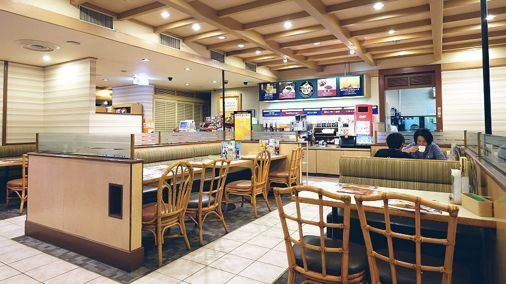
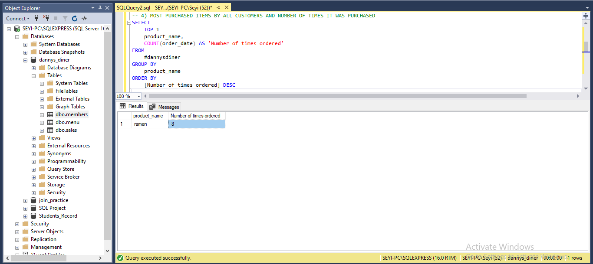
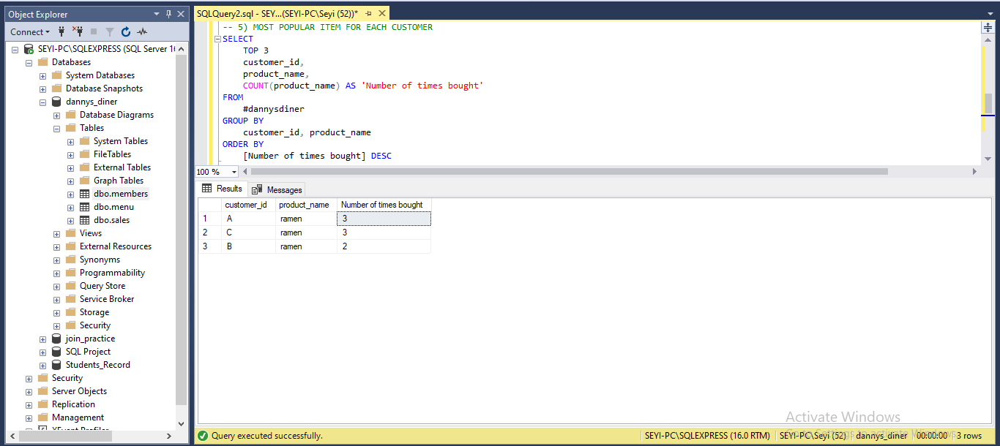
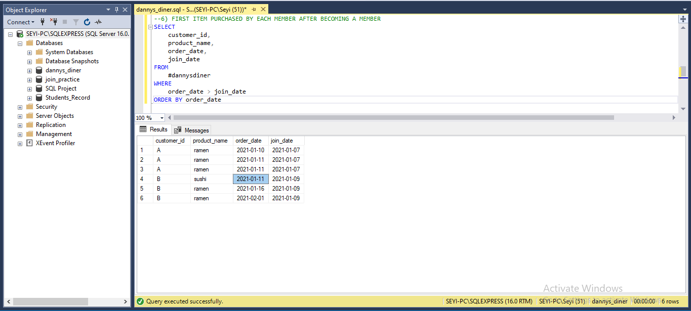
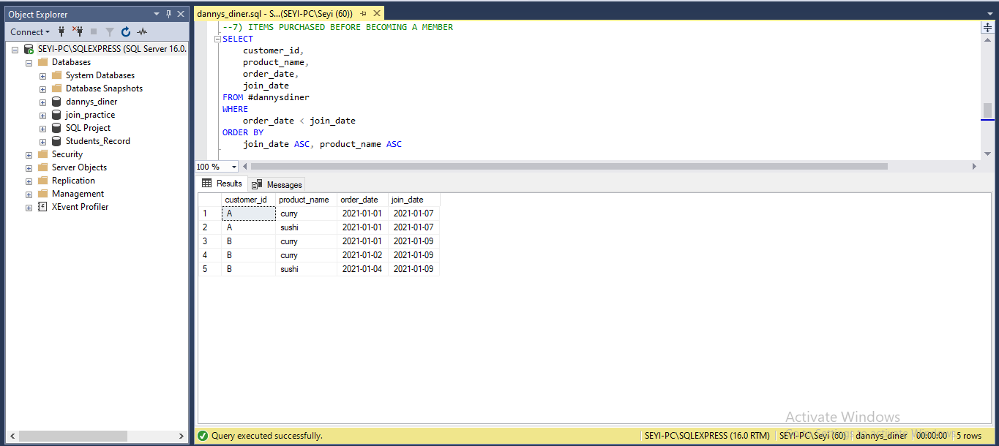
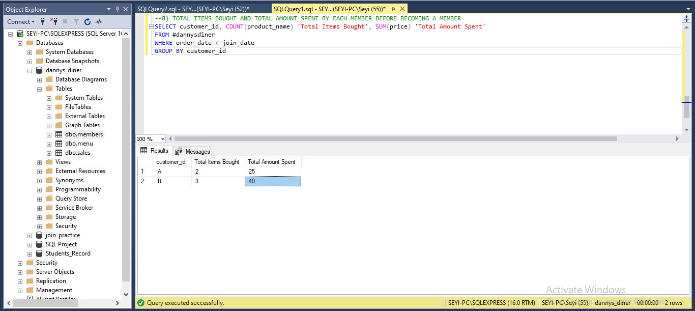

# ANALYSING DANNYS DINER CUSTOMER BUYING PATTERNS

## INTRODUCTION 
Danny just became an entrepreneur, he has been a lover of Japanese foods and at the beginning of 2021, he decides on opening his first Japanese restaurant. He decided to just serve his 3 favourite dishes which are; Sushi, Curry and Ramen. To help keep his restaurant afloat, he has employed my services as a data analyst to help analyse some of the basic patterns of his customers to help expand his business. 
## PROBLEM STATEMENT
To be a successful entrepreneur, Danny has decided he wants to create a deeper connection with his customer which will help him deliver a better and more personalised experience to his customers. He is currently running an existing customer loyalty program and he came up with some questions to help him decide if he should expand this loyalty program. To help Danny's diner understands its customer preferences and patterns and also give them an insight on what to improve on to better customer experience, the following were considered;
1. What is the most purchased item on the menu and how many times was it purchased by all customers?
2. Which item was the most popular for each customer?
3. Which item was purchased first by the customer after they became a member?
4. Which item was purchased just before the customer became a member?
5. What are the total items and amount spent for each member before they became a member?
Giving answers to these questions would help us gain insight into what item is purchased the most on the menu, how many registered customers are making purchases and how the marketing department is doing in advertising the diner's menu.
## UNDERSTANDING THE DATA 
The dataset used in this project was provided by this week's cohort instructor Victor Somadina, from the 8-weeks sql challenge, the dataset consists of 3 different tables which are; 
- sales: consisting of  3 columns(customer_id, order_date, product_id) and 15 rows of information about customer purchases.
- menu: consisting of 3 columns(product_id, product_name, price) and 3 rows of information about the diner's choice of food to be served.
- members: consists of 2 columns(customer_id, join_date) and 2 rows which show us the number of registered customers and the day of their registration.
## SKILLS DEMONSTRATED
- Data definition using the CREATE TABLE statement etc.
- Data manipulation using the SELECT, and INSERT statements.
- Data querying
## PROBLEM SOLVING
To begin the process of providing answers to the questions asked by the stakeholder of Danny's diner, I created a database to store the dataset that i will be working with, i then created each table i was supposed to be working with, i was provided with a dataset which shows little of the diner's operation in raw format. I employed my data definition skills using the **CREATE TABLE** statement to create each table and the columns within the table. I ensured the right data type is assigned to each column so as to prevent errors when querying the data. After creating each table, i was able to manipulate the database by using the **INSERT** statement to insert values into each table and also ensure each column had the right data type.

### WHAT IS THE MOST PURCHASED ITEM ON THE MENU AND THE NUMBER OF TIMES IT WAS PURCHASED BY ALL CUSTOMERS?

To know the customer's most prefered item on the menu, i created a temporary table by joining the sales table and the menu table together using the **LEFT JOIN** which allowed me to be able to gather insight easily from both tables on the customers' most bought item. I discovered after querying the database that all customers that have visited Danny's diner preferred to buy **RAMEN** making it the most purchased item on the menu bought by customers 8 times compared to other foods on the menu. 

### WHAT ITEM WAS MOST POPULAR FOR EACH CUSTOMER?

Still using the temporary table created earlier on, in answering this question, the use of data manipulation came into play as i made use of the aggregate function (COUNT) to get the number of times each item was ordered. I used the **TOP** function to display the top 3 items after sorting the dataset by the number of times each product was bought. As we can see from the image above, **RAMEN** is the most purchased item on the menu by each customer, this tells us that customers would order more ramen upon every visit to the diner compared to other items on the menu.

### WHAT ITEM WAS FIRST PURCHASED BY EACH CUSTOMER AFTER THEY BECAME A MEMBER OF DANNYS DINER

I was asked to look into the buying pattern of each customer after they became a member of the diner. I utilized my data manipulation skills by using the **SELECT FROM and WHERE** statements, using the **SELECT** statement, i was able to extract the list of items purchased after each customer became a member and i discovered that **Customer C** had made purchases also but wasn't a member of the diner, **Customer A** became a member of the diner on 2021-01-07 and afterwards made an order for **Ramen** on 2021-01-10, **Customer B** became a member of the diner on 2021-01-09 and made an order for **Sushi** on 2021-01-11.

### WHAT ITEM WAS PURCHSED JUST BEFORE EACH CUSTOMER BECAME A MEMBER

I decided to look at each customer's preference before they became members of the diner to know what item piqued their interest. This insight would help determine what item the diner should market more to the public to draw in more customer loyalty. To achieve this, I queried the previously created temporary table to display the items ordered where the order date is lesser than the join date and sorted it by the order date. The insight provided showed that the customers ordered **Sushi** just before the became members of the diner, this insight generated shows that customers enjoyed the sushi which served as a form of attraction to bring them to become members of the diner.

### WHAT IS THE TOTAL NUMBER OF ITEMS BOUGHT AND AMOUNT SPENT BY EACH CUSTOMER BEFORE THEY BECAME MEMBERS

